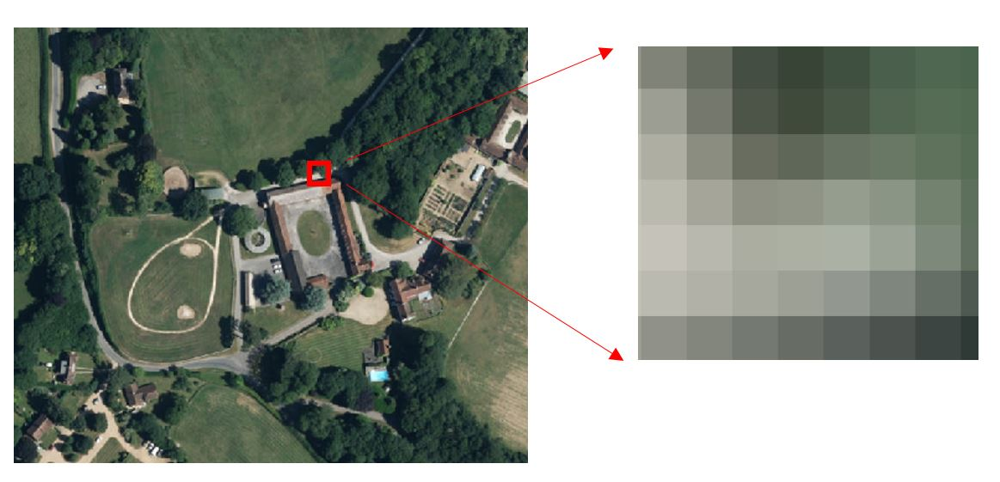

# Geospatial data types

## Raster v Vector
### Raster data
* cell based
* appropriate at a specific resolution

### Vector data
* points, lines, areas defined by XY(Z) coordinates
* less resolution dependent

See [the Wikipedia article of GIS formats](https://en.wikipedia.org/wiki/GIS_file_formats) for a comparison of raster and vector.

## Raster
### Raster data types
Cell values can represent:
* Colour
  * RGB
  
  * Paletted (eg 8 bit GIF, PNG)
*Continuous values
*Discrete thematic values

### Raster formats
Normal image formats, eg:
  * Tiff
  * Jpeg
  * Jpeg2000
  * PNG
  * GIF  etc
  
GIS formats, eg:
  * GeoTIFF
  * ESRI ASCII grid
  * GMLJP2
  * ERDAS ECW
  * LizardTech MrSID

###Georeferencing Rasters
Any 'GIS' raster formats have georeferencing information in-built into the header of the file (eg GeoTIFF).

```
set GDAL_DATA=C:\Program Files\QGIS Wien\share\gdal
set PATH="C:\Program Files\QGIS Wien\bin";%PATH%

gdalinfo "vmdras\SU00.tif"
```
```
Driver: GTiff/GeoTIFF
Files: vmdras\SU00.tif
Size is 4000, 4000
Coordinate System is:
LOCAL_CS["OSGB 1936 / British National Grid",
    GEOGCS["OSGB 1936",
        DATUM["unknown",
            SPHEROID["unretrievable - using WGS84",6378137,298.257223563],
            TOWGS84[446.448,-125.157,542.06,0.15,0.247,0.842,-20.489]],
        PRIMEM["Greenwich",0],
        UNIT["degree",0.0174532925199433]],
    AUTHORITY["EPSG","27700"],
    UNIT["metre",1]]
Origin = (400000.000000000000000,110000.000000000000000)
Pixel Size = (2.500000000000000,-2.500000000000000)
Metadata:
  AREA_OR_POINT=Area
  TIFFTAG_COPYRIGHT=Ordnance Survey. © Crown copyright and database right 2014
  TIFFTAG_IMAGEDESCRIPTION=OS VectorMap® District - Full colour raster - TILE SU00
  TIFFTAG_RESOLUTIONUNIT=2 (pixels/inch)
  TIFFTAG_XRESOLUTION=254
  TIFFTAG_YRESOLUTION=254
Image Structure Metadata:
  COMPRESSION=LZW
  INTERLEAVE=BAND
Corner Coordinates:
Upper Left  (  400000.000,  110000.000)
Lower Left  (  400000.000,  100000.000)
Upper Right (  410000.000,  110000.000)
Lower Right (  410000.000,  100000.000)
Center      (  405000.000,  105000.000)
Band 1 Block=4000x32 Type=Byte, ColorInterp=Palette
  Color Table (RGB with 256 entries)
    0: 101,98,98,255
    1: 113,113,113,255
    2: 115,113,113,255
    3: 126,124,124,255
```


#### World files
Non-GIS formats need a 'world file' to provide a geographic context for the image.  Here is an example world file:

```
100.000000000000000
0.000000000000000
0.000000000000000
-100.000000000000000
50.000000000000000
1299950.000000000000000
```
See [the Wikipedia article](https://en.wikipedia.org/wiki/World_file) for a detailed explanation, or [ESRI's briefer explanation](http://desktop.arcgis.com/en/desktop/latest/manage-data/raster-and-images/world-files-for-raster-datasets.htm).

### Raster Composites
#### ArcGIS Image Catalog
Two types

* managed - raster data is stored in the image catalog
* unmanaged - raster data stays in source files, image catalog is simply a lookup file.

TODO - Add instructions here


#### GDAL VRT file
GDAL can be used to create a VRT file,which acts as an index to multiple files.
```
set GDAL_DATA=C:\Program Files\QGIS Wien\share\gdal
set PATH="C:\Program Files\QGIS Wien\bin";%PATH%
cd ea-lidar-1m

gdalbuildvrt -a_srs EPSG:27700 ea-lidar.vrt *.asc
```
* This can be displayed in QGIS and assigned a colour ramp
* VRT files are supported in ArcGIS.

This can be displayed in QGIS and assigned a colour ramp.  The environment Agency have an [interactive map for LIDAR download](http://environment.data.gov.uk/ds/survey#/download).  Click on the map to select a square, and download options will appear below the map.

### Raster processing
Raster processing is cell based.  Types:

* raster algebra (eg Raster A + Raster B) - see Raster Calculator in QGIS.
* cell based processing in a local region around each cell.

Example of the latter is terrain analysis.  The following [GDAL terrain functions](http://www.gdal.org/gdaldem.html) are also available as menu items in QGIS.

#### Hillshade
```
gdaldem hillshade ea-lidar.vrt ea-lidar-hillshade.tif
```

#### Slope
```
gdaldem slope ea-lidar.vrt ea-lidar-slope.tif
```

#### Aspect
```
gdaldem aspect ea-lidar.vrt ea-lidar-aspect.tif
```

#### Visibiity Analysis
See the Processing Toolbox in QGIS.  Grass > Raster > r.los

data\panaorama\su02.asc
Viewing position:  413721,132662
Max distance 10000

Can hillshade su02, this time using QGIS Raster Menu > Terrain Analysis > Hillshade

### 3D Visualisation
Use the Qgis2threejs plugin.

# Geospatial Web Services
Can add Web Map Service (WMS) layers.  [Good description in Geoserver docs](http://docs.geoserver.org/stable/en/user/services/wms/reference.html).

[British Geological Survey WMS Services](http://www.bgs.ac.uk/data/services/digmap50wms.html)
1:50k Geology:  https://map.bgs.ac.uk/arcgis/services/BGS_Detailed_Geology/MapServer/WMSServer?

Example GetMap request: https://map.bgs.ac.uk/arcgis/services/BGS_Detailed_Geology/MapServer/WMSServer?REQUEST=GetMap&VERSION=1.3.0&LAYERS=BGS.50k.Bedrock&STYLES=default&FORMAT=image/gif&CRS=EPSG:27700&BBOX=400000,400000,405200,405200&WIDTH=450&HEIGHT=450

Example GetFeatureInfo request: https://map.bgs.ac.uk/arcgis/services/BGS_Detailed_Geology/MapServer/WMSServer?version=1.3.0&request=GetFeatureInfo&format=image/png&layers=BGS.50k.Bedrock&query_layers=BGS.50k.Bedrock&info_format=text/html&i=200&j=400&radius=0&crs=EPSG:27700&BBOX=400000,400000,405200,405200&WIDTH=450&HEIGHT=450&styles=default


### 3D Visualisation
Use the Qgis2threejs plugin to export section of Lidar.  Use Qgis2threejs button.  Choose DEM to use for height of terrain.

Another example:  http://labs.geodigging.co.uk/worbarrow/worbarrow.html.  View page source to see how data is encoded (including image as Base 64 encoding).


