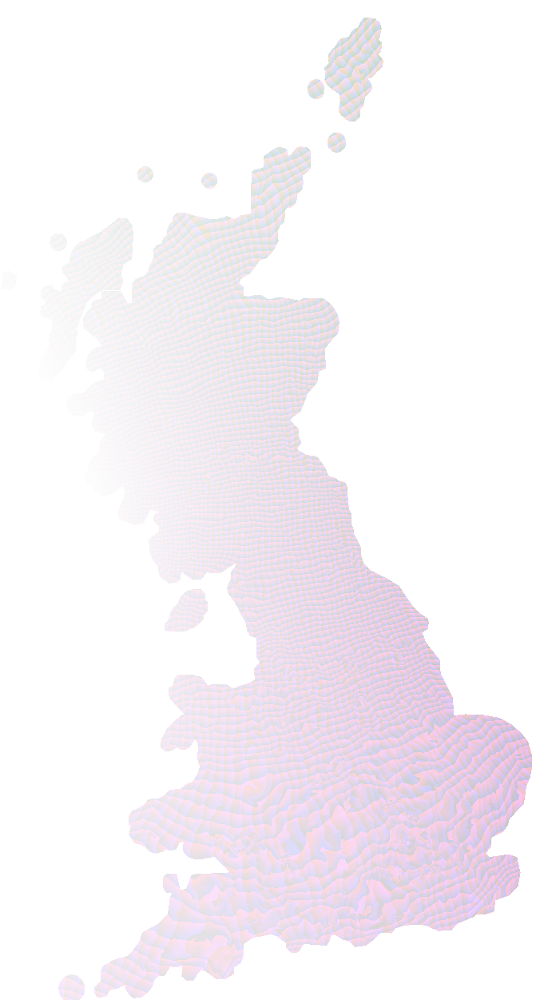

# Projecting OSGB Data
* The best resource is:  [OSTN02 and OSGM02](https://www.ordnancesurvey.co.uk/business-and-government/help-and-support/navigation-technology/os-net/formats-for-developers.html)
* In the zip file that can be downloaded, see [A_Guide_to_Coordinate_Systems_in_Great_Britain.pdf](resources/ostn02-ogm02-files/A_Guide_to_Coordinate_Systems_in_Great_Britain.pdf).  In particular;
	* Section 1.2 - A few myths about coordinate systems
	* Page 24: "Hence the overall size of the TRF still used for British mapping came to be derived from the measurement of a single distance between two stations on Hounslow Heath in 1784 using eighteen-foot glass rods! The error thus incurred in OSGB36 is surprisingly low – only about 20 metres in the length of the country."
	* Page 29:  "no exact transformation exists between two geodetic coordinate systems."
	* Page 30:  "The Helmert transformation is designed to transform between two datums, and it cannot really cope with distortions in TRFs."
	* Page 30:  "using a single Helmert transformation will give errors of up to 5 metres, depending where in the country the points of interest are. One solution to this is to compute a special set of Helmert parameters for a particular region – this is known as a ‘local transformation’. Alternatively, more complex transformation types that model TRF distortion can be used. An example of this is the National Grid Transformation OSTN02"
	* Page 30:  "To summarise: For a simple datum change of latitude and longitude coordinates from datum A to datum B, first convert to Cartesian coordinates (formulae in annexe B), taking all ellipsoid heights as zero and using the ellipsoid parameters of datum A; then apply a Helmert transformation from datum A to datum B using equation (3); finally convert back to latitude and longitude using the ellipsoid parameters of datum B (formulae in annexe C), discarding the datum B ellipsoid height."
	* Page 31:  "To cope with the distortions in the OSGB36 TRF, different transformations are needed in different parts of the country. For this reason, the national standard datum transformation between OSGB36 and ETRS89 is not a simple Helmert datum transformation. Instead, Ordnance Survey has developed a ‘rubber-sheet’ style transformation that works with a transformation grid expressed in easting and northing coordinates. The grids of northing and easting shifts between ETRS89 and OSGB36 cover Britain at a resolution of one kilometre. From these grids, a northing and easting shift for each point to be transformed is obtained by a bilinear interpolation. This is called the National Grid Transformation OSTN02, and it is freely available in software packages from the Ordnance Survey GPS website"

## Helmert Transformation	
* The appendix gives the formulae for applying a 7 parameter Helmert transformation when converting from WGS84 to British National Grid (and back again).  This is fairly straightforward to code - eg see [src/helmert/OSGBConverter.js](src/helmert/OSGBConverter.js)

## OSTN02 Transformation
* To do a high accuracy transformation, use OSTN02 - see [Transformations and OSGM02 user guide.pdf](resources/ostn02-ogm02-files/Transformations and OSGM02 user guide.pdf).
* A grid of adjustments is applied to transformed cartesian coordinates.  Text adjustment file has following fields:

	* Record no 
	* ETRS89 easting(m)
	* ETRS89 northing(m)
	* OSTN02 east shift(m)
	* OSTN02 north shift(m)
	* OSGM02 Geoid Ht(m)
	* Geoid datum flag
	
Example:

```
180065,608000,256000,100.724,-78.396,45.121,1
180066,609000,256000,100.750,-78.401,45.106,1
180067,610000,256000,100.777,-78.407,45.091,1
180068,611000,256000,100.803,-78.413,45.076,1
180069,612000,256000,100.829,-78.418,45.062,1
180070,613000,256000,100.862,-78.425,45.047,1
180071,614000,256000,100.902,-78.431,45.033,1
```

Note the test point spreadsheets in the zip to verify transformations.

Can use the following Python to create an image of the variation in the adjustments:

```
import csv
import numpy
from PIL import Image

ecol = 3
ncol = 4

# Note easting shift values range from 86.275 to 103.443
eoffset = -86
# Note northing shift values range from -81.603 to -50.168
noffset = 82

def ostn02_to_img(csvfn, imagefn, w, h):
    arrimg = numpy.empty((h,w), numpy.uint32)
    arrval = numpy.empty(2, numpy.uint16)
	
    f = open(csvfn, "rb")
    reader = csv.reader(f)
    i = 0
    for row in reader:
        if row[ecol] == "0.000":
            arrimg[h - (i/w) - 1, i%w] = 0
        else:
            arrval[0] = int(abs(float(row[ecol]) + eoffset) * 1000)
            arrval[1] = int(abs(float(row[ncol]) + noffset) * 1000)
            arrimg[h - (i/w) - 1, i%w] = (arrval[0] << 16) | arrval[1]
        i = i + 1

        
    pilImage = Image.frombuffer('RGBA',(w,h),arrimg,'raw','RGBA',0,1)
    pilImage.save(imagefn)

ostn02_to_img(r"OSTN02_OSGM02_GB.txt",
              r"OSTN02_OSGM02_GB.png",
              701, 1251)
```	
Output image is:


## Transforming data in existing software packages
* Most geospatial software will apply a Helmert transformation by default
* This can be up to 5m accuracy.  This is acceptable for some data applications and resolutions.
* To apply the OSTN02 transformation, most packages support the use of a NTv2  - see [the OS OSTN02 – NTv2 format page](https://www.ordnancesurvey.co.uk/business-and-government/help-and-support/navigation-technology/os-net/ostn02-ntv2-format.html).  Doiwnload zip containing .gsb file from here.

### An example using GDAL/OGR

```
set GDAL_DATA=C:\Program Files\QGIS Wien\share\gdal
set PROJ_LIB=C:\Program Files\QGIS Wien\share\proj
set PROJ_DEBUG=true
set PATH="C:\Program Files\QGIS Wien\bin";%PATH%

cd demo\data\ostn02

# Transform OSGB points to WGS84 using accurate transformation
ogr2ogr -t_srs EPSG:4326 -s_srs "+init=EPSG:27700 +nadgrids=..\..\..\resources\ostn02-ntv2\OSTN02_NTv2.gsb" -f GeoJSON test_wgs84_ntv2.json test_osgb.json

# Transform WGS84 to OSGB using 3 parameter transformation
ogr2ogr -t_srs "+proj=tmerc +lat_0=49 +lon_0=-2 +k=0.999601 +x_0=400000 +y_0=-100000 +ellps=airy +units=m +no_defs +towgs84=375,-111,431" -s_srs EPSG:4326  -f GeoJSON osgb_3param.json test_wgs84_ntv2.json
## Remember to paste EPSG into the output file before adding toQGIS ##

# Transform using default 7 parameter Helmert transformation
ogr2ogr -t_srs EPSG:27700 -s_srs EPSG:4326 -f GeoJSON osgb_7param.json test_wgs84_ntv2.json

# Transform using NTv2 transformation
ogr2ogr -t_srs "+init=EPSG:27700 +nadgrids=..\..\..\resources\ostn02-ntv2\OSTN02_NTv2.gsb" -s_srs EPSG:4326 -f GeoJSON osgb_ntv2.json test_wgs84_ntv2.json
```

Add the GeoJSON files to QGIS along with image giving context in demo\data\ostn02.

### An example using FME
* FME does support the NTv2 adjustment grid
* Also there is the intuitively named [GridInQuestReprojector](http://docs.safe.com/fme/html/FME_Transformers/FME_Transformers.htm#Transformers/gridinquestreprojector.htm)
	* Only supported as 32 bit
	* Only supported in Windows (I think)
* See example FME workspace:  **demo\fme-gridinquestreprojector.fmw** and output shapefile data at **demo\data\ostn02**